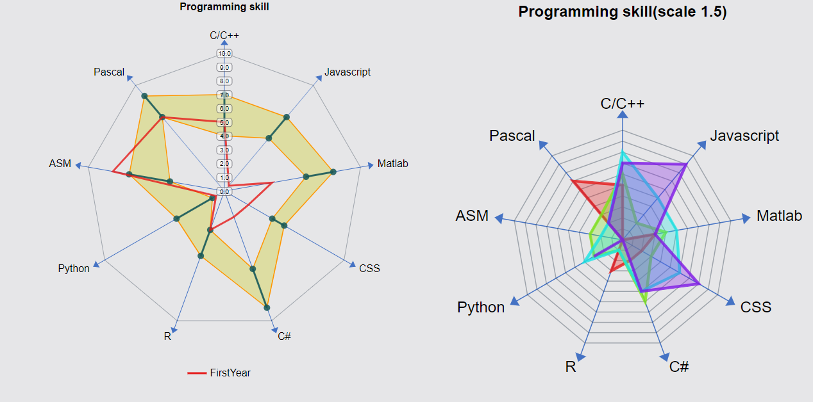

# VCHART

SVG chart, base on absol.js
-----------------------


## Linechart

[](https://volcanion.cf/vchart/demo/linechart.html)

```js
var results = Array(12).fill(0).map(function () {
    return 23 + Math.floor(600 * Math.random());
});
var results1 = Array(12).fill(0).map(function () {
    return 23 + Math.floor(600 * Math.random());
});
vchart._({
    tag: 'linechart',
    props: {
        title: 'Bão lãnh thanh toán',
        valueName: '$',
        keyName: 'Tháng',
        zeroOY: true,
        keys: ['Tháng 1', 'Tháng 2', 'Tháng 3', 'Tháng 4', 'Tháng 5', 'Tháng 6', 'Tháng 7', 'Tháng 8', 'Tháng 9', 'Tháng 10', 'Tháng 11', 'Tháng 12'],
        lines: [
            {
                name: 'Đường 1',
                values: results,
                texts: texts,
                color: 'red',
                plotColors: ['blue']
            },
            {
                name: 'Đường 2',
                values: results1,
                texts: texts,
                color: 'pink',
                plotColors: ['cyan']
            }
        ]
}).addTo(document.body)
```

## CurveChart

[](https://volcanion.cf/vchart/demo/curvechart.html)

```js
var results = Array(12).fill(0).map(function () {
    return 23 + Math.floor(600 * Math.random());
});
var results1 = Array(12).fill(0).map(function () {
    return 23 + Math.floor(600 * Math.random());
});
vchart._({
    tag: 'curvechart',
    props: {
        title: 'Bão lãnh thanh toán',
        valueName: '$',
        keyName: 'Tháng',
        zeroOY: true,
        keys: ['Tháng 1', 'Tháng 2', 'Tháng 3', 'Tháng 4', 'Tháng 5', 'Tháng 6', 'Tháng 7', 'Tháng 8', 'Tháng 9', 'Tháng 10', 'Tháng 11', 'Tháng 12'],
        lines: [
            {
                name: 'Đường 1',
                values: results,
                texts: texts,
                color: 'red',
                plotColors: ['blue']
            },
            {
                name: 'Đường 2',
                values: results1,
                texts: texts,
                color: 'pink',
                plotColors: ['cyan']
            }
        ]
}).addTo(document.body)
```


## DualChart(Area-Line)
[](https://volcanion.cf/vchart/demo/dualchart.html)
[](https://volcanion.cf/vchart/demo/dualchart.html)


```js
var minA = Array(12).fill(0).map(function () {
    return Math.floor(Math.random() * 200) + 100;
});

var midA = minA.map(function (v) {
    return 300 + Math.floor(Math.random() * 200);
});
var maxA = Array(12).fill(700);
var results = Array(12).fill(0).map(function () {
    return 23 + Math.floor(600 * Math.random());
});
var results1 = Array(12).fill(0).map(function () {
    return 23 + Math.floor(600 * Math.random());
});

var texts = Array(12).fill(0).map(function (u, i) {
    return 'Tối đa: ' + maxA[i] + '\nTối thiểu: ' + minA[i] + '\nTrung bình: ' + midA[i] + '\nĐạt được: ' + results[i];
});


vchart._({
    tag: 'dualchart',
    props: {
        title: 'Bão lãnh thanh toán',
        valueName: '$',
        keyName: 'Tháng',
        zeroOY: true,
        keys: ['Tháng 1', 'Tháng 2', 'Tháng 3', 'Tháng 4', 'Tháng 5', 'Tháng 6', 'Tháng 7', 'Tháng 8', 'Tháng 9', 'Tháng 10', 'Tháng 11', 'Tháng 12'],
        lines: [
            {
                name: 'Đường 1',
                values: results,
                texts: texts,
                color: 'red',
                plotColors: ['blue']
            },
            {
                name: 'Đường 2',
                values: results1,
                texts: texts,
                color: 'pink',
                plotColors: ['cyan']
            }
        ],
        areas: [
            {
                name: 'Tối đa',
                values: maxA,
                color: 'rgb(255, 204, 127)'
            },

            {
                name: 'Trung bình',
                values: midA,
                color: 'rgb(204, 204, 127)'
            },
            {
                name: 'Thấp',
                values: minA,
                color: 'rgb(231, 228, 227)'
            }
        ]
    }
}).addTo(document.body)


vchart._({
    tag: 'dualchart',
    props: {
        title: 'Bão lãnh thanh toán(đứt đoạn)',
        valueName: '$',
        keyName: 'Tháng',
        zeroOY: true,
        keys: ['Tháng 1', 'Tháng 2', 'Tháng 3', 'Tháng 4', 'Tháng 5', 'Tháng 6', 'Tháng 7', 'Tháng 8', 'Tháng 9', 'Tháng 10', 'Tháng 11', 'Tháng 12'],
        lines: [
            {
                name: 'Đường 1',
                values: [3000, '-', 3010, 4200, '-', 2000, 2500, 2600, '-', 3000, '-', 3700],
                texts: texts,
                color: 'red',
                plotColors: ['blue', 'red', 'cyan', 'green', 'blue', 'red', 'cyan', 'green', 'blue', 'red', 'cyan', 'green']
            },
            {
                name: 'Đường 2',
                values: results1,
                texts: texts,
                color: 'pink',
                plotColors: ['cyan']
            }
        ],
        areas: [
            {
                name: 'Tối đa',
                values: [5000, '-', 4010, 5200, '', 3000, 3500, 3000, '', 4500, '-', 1500],
                color: 'rgb(255, 204, 127)'
            },

            {
                name: 'Trung bình',
                values: [4000, '-', 3300, 3500, '', 2400, 2500, 2600, '', 3000, '-', 3100],
                color: 'rgb(204, 204, 127)'
            },
            {
                name: 'Thấp',
                values: [1200, '-', 2200, 1200, '', 1100, 1300, 1200, '', 1500, '-', 1170],
                color: 'rgb(231, 228, 227)'
            }
        ]
    }
}).addTo(document.body)

```


## RangeChart(O-stick-chart)

[](https://volcanion.cf/vchart/demo/rangechart.html)

```js
   var y = vchart._({
        tag: 'rangechart',
        style: { background: 'rgb(230, 230, 232)', width: '1024px', height: 1024 * 600 / 700 + 'px' },
        props: {
            title: 'Biểu đồ lương chức danh',
            valueName: 'lương',
            keyName: 'chức danh', 
            canvasWidth: 900,
            canvasHeight: 600,
            zeroOY: true,
            numberToString: vchart.lambda.toLocalString(0),
            maxText: 'Lương tối thiểu',
            minText: 'Lương tối thiểu',
            midText: 'Lương ở giữa',
            normalText: 'Lương thị trường',
            ranges: [
                {
                    name: 'Giám đốc',
                    min: 3000000.4838583485835,
                    max: 5000000.48237573475,
                    mid: 3500000.5275834579345,
                    normal: 4000000.5723957239
                },
                {
                    name: 'Trưởng phòng tài chính',
                    min: 4000000,
                    max: 7500000,
                    mid: 10000000,
                    normal: 8000000
                },
                {
                    name: 'Trưởng phòng kế hoạch',
                    min: 2100000,
                    max: 7900000,
                    mid: 6000000,
                    normal: 7000000
                },
                {
                    name: 'Kế toán',
                    min: 2500000,
                    max: 5000000,
                    mid: (500000 + 5000000) / 2,
                    normal: 3000000
                },
                {
                    name: 'Nhân sự',
                    min: 6000000,
                    max: 9000000,
                    mid: (900000 + 9000000) / 2,
                    normal: 4000000
                }
            ]

        }

    }).addTo(document.body);
```

> Có thể bỏ bớt mid và normal

## AssessmentChart

[](https://volcanion.cf/vchart/demo/assessmentchart.html)

```js

var x = vchart._({
    tag: 'assessmentchart',
    style: { background: 'rgb(230, 230, 232)' },
    props: {
        simpleMode:true,
        title: 'Programming skill',
        canvasWidth: 700,
        canvasHeight: 600,
        levels: ['0.0', '1.0', '2.0', '3.0', '4.0', '5.0', '6.0', '7.0', '8.0', '9.0', '10.0'],
        keys: ['C/C++', 'Javascript', 'Matlab', 'CSS', 'C#', 'R', 'Python', 'ASM', 'Pascal'],
        ranges: [
            [4, 7],
            [5, 7],
            [6, 8],
            [4, 5],
            [6, 9],
            [3, 5],
            [1, 4],
            [4, 7],
            [7, 9]
        ],
        areas: [
            {
                name: 'FirstYear',
                values: [5, 0.5, 3.5, 2, 2, 3, 0.7, 8.2, 7]
            }
        ]
    }

}).addTo(document.body);

var a = vchart._({
    extendEvent: 'contextmenu',
    tag: 'assessmentchart',
    style: { background: 'rgb(230, 230, 232)' },
    props: {
        title: 'Programming skill',
        canvasWidth: 900,
        canvasHeight: 900,
        levels: ['0.0', '1.0', '2.0', '3.0', '4.0', '5.0', '6.0', '7.0', '8.0', '9.0', '10.0'],
        keys: ['C/C++', 'Javascript', 'Matlab', 'CSS', 'C#', 'R', 'Python', 'ASM'],
        areas: [
            {
                name: 'FirstYear',
                values: [5, 0, 3, 2, 2, 3, 0, 0]
            },
            {
                name: 'ThirdYear',
                values: [6, 2, 4, 3, 6, 1, 3, 3]

            },
            {
                name: 'FifthtYear',
                values: [8, 5, 5, 6, 5, 1, 4, 2]
            },
            {
                name: 'FinalYear',
                values: [7, 9, 3, 8, 5, 0, 3, 0]
            }
        ],
         numberToString: vchart.lambda.toLocalString(0)

    }
    , on: chartEventHandlers
}).addTo(document.body);
```

## ColumnChart, ColumnAreaChart

[](https://volcanion.cf/vchart/demo/columnareachart.html)

```js
var a = vchart._({
        tag: 'columnchart',
        style: { background: 'rgb(230, 230, 232)' },
        props: {
            title: 'Biểu đồ độ ẩm',
            valueName: '%',
            keyName: 'tháng',
            canvasWidth: 800,
            canvasHeight: 600,
            zeroOY: true,
            rotateText: false,
            showInlineValue: true,
            columnWidth: 40,
            numberToString: vchart.lambda.toLocalString(1),
            keys: ['Tháng giêng', 'Tháng 2', 'Tháng 3', 'Tháng 4', 'Tháng 5',
                'Tháng 6', 'Tháng 7', 'Tháng 8', 'Tháng 9', 'Tháng 10', 'Tháng 11', 'Tháng chạp'],
            values: Array(12).fill(0).map(function () {
                return 23 + 70 * Math.random();
            })
        }
    }).addTo(document.body);

```

[](https://volcanion.cf/vchart/demo/columnareachart.html)

```js
 var minA = Array(12).fill(0).map(function () {
        return Math.floor(Math.random() * 50) + 1;
    });

    var midA = minA.map(function (v) {
        return v + 10 + Math.floor(Math.random() * 50);
    });
    var maxA = midA.map(function (v) {
        return v + 10 + Math.floor(Math.random() * 50);
    });


    var c = vchart._({
        tag: 'columnareachart',
        style: { border: 'solid 1px black' },
        props: {
            title: 'Biểu đồ độ ẩm',
            valueName: '%',
            keyName: 'tháng',
            canvasWidth: 800,
            canvasHeight: 600,
            zeroOY: true,
            rotateText: false,
            showInlineValue: true,
            columnWidth: 20,
            numberToString: vchart.lambda.toLocalString(1),
            keys: ['Tháng giêng', 'Tháng 2', 'Tháng 3', 'Tháng 4', 'Tháng 5',
                'Tháng 6', 'Tháng 7', 'Tháng 8', 'Tháng 9', 'Tháng 10', 'Tháng 11', 'Tháng chạp'],
            values: Array(12).fill(0).map(function () {
                return 23 + 70 * Math.random();
            }),
            colName: 'Mục tiêu',
            areas: [
                {
                    name: 'Tối đa',
                    values: maxA,
                    color: 'rgb(255, 204, 127)'
                },

                {
                    name: 'Trung bình',
                    values: midA,
                    color: 'rgb(204, 204, 127)'
                },
                {
                    name: 'Thấp',
                    values: minA,
                    color: 'rgb(231, 228, 227)'
                }
            ]
        }
    }).addTo(document.body);
```

## RangeGroupChart

[](https://volcanion.cf/vchart/demo/rangegroupchart.html)

```js
var x = vchart._({
    tag: 'rangegroupchart',
    style: { background: 'rgb(230, 230, 232)' },
    props: {
        title: 'Biểu đồ lương chức danh',
        valueName: 'lương',
        keyName: 'chức danh',
        canvasWidth: 900,
        canvasHeight: 600,
        zeroOY: true,
        // maxSegment: 20,
        numberToString: vchart.lambda.toLocalString(0),
        maxText: 'Lương tối thiểu',
        minText: 'Lương tối thiểu',
        normalText: 'Lương thị trường',
        ranges: [
            {
                name: 'Giám đốc',
                min: 15000000,
                max: 25000000,
                normal: 19000000,
                members: [
                    {
                        name: 'Lê Hoàng Nhật Trí',
                        value: 19000000
                    },
                    {
                        name: 'Đào Công Cường',
                        value: 21000000
                    },
                    {
                        name: 'Đào Duy Mạnh',
                        value: 17000000
                    }
                ]
            },
            {
                name: 'Trưởng phòng',
                min: 11000000,
                max: 19000000,
                normal: 20000000,
                members: [
                    {
                        name: 'Võ Văn Toàn Phong',
                        value: 12000000
                    },
                    {
                        name: 'Huỳnh Bá Lộc',
                        value: 14000000
                    },
                    {
                        name: 'Hàn Bá Đa',
                        value: 17000000
                    }
                ]
            },
            {
                name: 'Trưởng phòng',
                min: 9000000,
                max: 18000000,
                normal: 18500000,
                members: [
                    {
                        name: "Đinh Văn Biết",
                        value: 9000000
                    },
                    {
                        name: 'Nguyễn Văn Mạnh',
                        value: 10000000
                    },
                    {
                        name: 'Nguyễn Hoàng Kim Trâm',
                        value: 9800000
                    }
                ]
            }

        ]

    }

}).addTo(document.body);

```

## RankChart

[](https://volcanion.cf/vchart/demo/rankchart.html)

```js
var x = vchart._({
    tag: 'rankchart',
    props: {
        title: 'Biểu đồ  bậc lương',
        valueName: 'lương',
        canvasWidth: 1200,
        canvasHeight: 600,
        zeroOY: true,
        valueName: 'lương(VND)',
        keyName: 'chức danh',
        numberToString: vchart.lambda.toLocalString(0),
        positions: [
            {
                name: 'Giám đốc',
                ranks: [13000000, 15000000, 16500000, 17700000, 19000000, 20900000, 21000000, 21500000]
            },
            {
                name: 'Trưởng phòng tài chính',
                ranks: [15000000, 17000000, 17500000, 18500000, 19700000, 20000000, 21000000, 21500000, 21700000]
            },
            {
                name: 'Trưởng phòng nhân sự',
                ranks: [13000000, 14000000, 15500000, 16500000, 17700000, 18000000, 19000000, 20500000, 21700000]
            },
            {
                name: 'Trưởng phòng kế toán',
                ranks: [11000000, 11200000, 13500000, 14100000, 15000000, 16100000, 17000000, 18500000, 19700000]
            }

        ]
    }


}).addTo(document.body);
```


## SunburstChart
[](https://volcanion.cf/vchart/demo/sunburstchart.html)

```js
var x = vchart._({
    tag: 'sunburstchart',
    props: {
        // title: 'absol js code analysis',
        canvasWidth: 900,
        canvasHeight: 600,
        zeroOY: true,
        numberToString: vchart.lambda.toLocalString(3),
        root: {
            name: 'Năng lực cốt lõi',
            value: 22,
            child: [{
                fillColor: 'rgb(115, 90, 145)',
                name: 'Năng lực chuyên môn nghiệp vụ',
                value: 7,
                child: [
                    { name: 'Nhân sự', value: 1 },
                    { name: 'Tài chính', value: 1 },
                    { name: 'Phạm vi, tác động', value: 1 },
                    { name: 'MMTB, CNKT', value: 1 },
                    { name: 'Năng lực ra quyết định', value: 1 },
                    { name: 'Tổ chức điều hành', value: 1 },
                    { name: 'Đàm phán', value: 1}
                ]
            },
            {
                fillColor: 'rgb(159, 175, 91)',
                name: 'Năng lực chung',
                value: 7,
                child: [
                    { name: 'Tổng hợp', value: 1 },
                    { name: 'Báo cáo', value: 1 },
                    { name: 'Thu thập thông tin', value: 1 },
                    { name: 'Làm việc nhóm', value: 1 },
                    { name: 'Giao tiếp', value: 1 },
                    { name: 'Ngoại ngữ', value: 1 },
                    { name: 'Vi tính văn phòng', value: 1 }
                ]
            },
            { name: 'Ra quyết định', value: 1, fillColor: 'auto', span: 2 },
            { name: 'Kiểm tra giám sát', value: 1, fillColor: 'auto', span: 2 },
            { name: 'Tổ chức', value: 1, fillColor: 'auto', span: 2 },
            { name: 'Hoạch định', value: 1, fillColor: 'auto', span: 2 },
            {
                fillColor: 'rgb(71, 116, 170)',
                name: 'Năng lực lãnh đạo',
                value: 4,
                child: [
                    { name: 'Định hướng hiệu quả', value: 1 },
                    { name: 'Tạo động lực nhân viên', value: 3 },
                ]
            }
            ]
        }
    }

}).addTo(document.body);
```

## SquareChart
[](https://volcanion.cf/vchart/demo/squarechart.html)

```js
var y = vchart._({
    tag: 'squarechart',
    props: {
        canvasHeight: 400,
        canvasWidth: 500,
        title: 'Tương quan hệ số lương',
        valueName: 'Lương',
        keyName: 'Chức danh',
        keys: ['Tạp vụ', 'Nhân viên', 'Trưởng phòng', 'Giám đốc'],
        static: { y0: 0.1, k: 7 },
        dynamic: { y0: 0.1, k: 2 },

    }
}).addTo(document.body);
```

## GroupRankChart
[](https://volcanion.cf/vchart/demo/squarechart.html)

```js

var x = vchart._({
    tag: 'grouprankchart',
    style: { background: 'rgb(230, 230, 232)' },
    props: {
        title: 'Biểu đồ lương nhóm chức danh',
        valueName: 'lương',
        canvasWidth: 500,
        canvasHeight: 600,
        zeroOY: true,
        valueName: 'lương(VND)',
        numberToString: vchart.lambda.toLocalString(0),
        groups: [
            {
                name: 'Nhóm trưởng phòng',
                members: [
                    {
                        name: "Trưởng phòng tài chính",
                        value: 17000000
                    },
                    {
                        name: 'Trưởng phòng kinh doanh',
                        value: 13000000
                    },
                    {
                        name: "Trưởng phòng nhân sự",
                        value: 11000000
                    },
                    {
                        name: 'Trưởng phòng kế toán',
                        value: 12500000
                    },

                ]
            },
            {
                name: "hỏi nhiều quá",
                members: [
                    {
                        name: 'Giám đốc',
                        value: 20000000
                    },
                    {
                        name: 'Phó giám đốc',
                        value: 17000000
                    },
                    {
                        name: 'Giám đốc kĩ thuật',
                        value: 15000000
                    },
                    {
                        name: 'Giám đốc tài chính',
                        value: 21000000
                    }

                ]
            }
        ]
    }

}).addTo(document.body);

```


## SalaryScaleChart
[](https://volcanion.cf/vchart/demo/salaryscalechart.html)
[](https://volcanion.cf/vchart/demo/salaryscalechart.html)

```js
    var sic = vchart._({
            tag: 'salaryscalechart',
           
            props: {
                canvasWidth: 400,
                canvasHeight: 320,
                bonus: -50,//pecent
                minDistance: 10,//pecent
                distance: 500,//pecent,
                colTexts: ['Bậc 1', 'Bậc 4', 'Bậc 5'],
            }
        }).addTo(document.body);

    var sic1 = vchart._({
            tag: 'salaryscalechart',
           
            props: {
                canvasWidth: 560,
                canvasHeight: 320,
                bonus: 50,//pecent
                minDistance: 10,//pecent
                distance: 500,//pecent,
                colTexts: ['Bậc 1', 'Bậc 4', 'Bậc 5'],
                distText : 'Khoảng cách lương',
                minDistText : 'Khoảng cách tối thiểu',
                bonusText : 'Hệ số ưu đãi (10%)'
            }
        }).addTo(document.body);
```